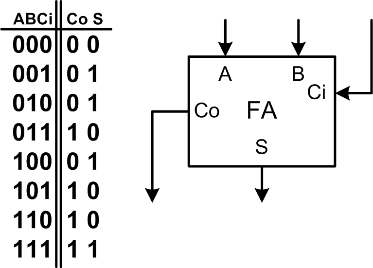
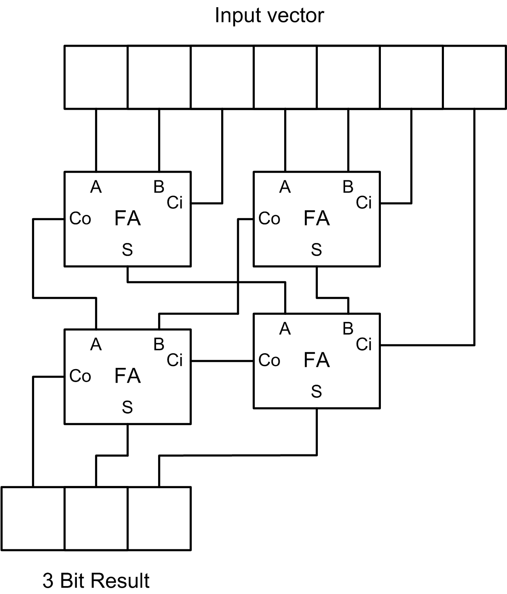
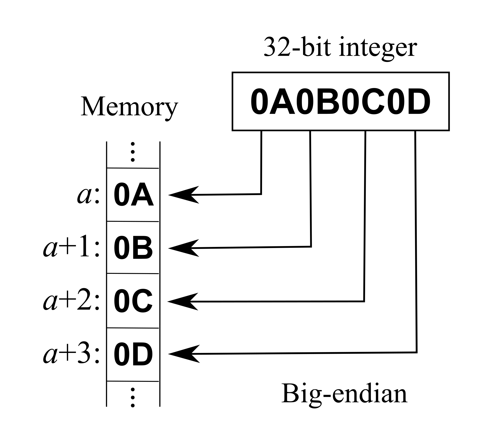
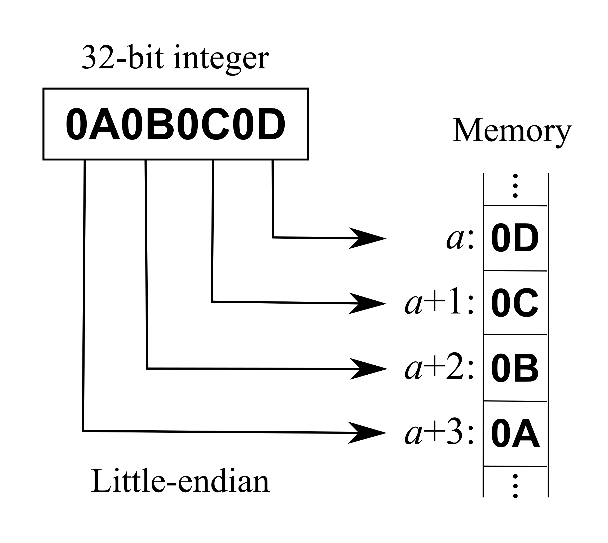
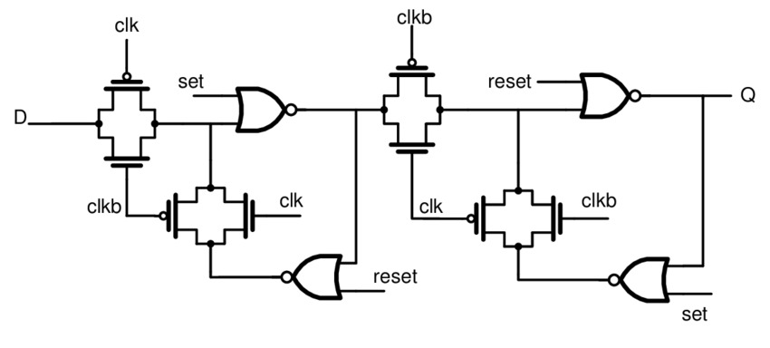
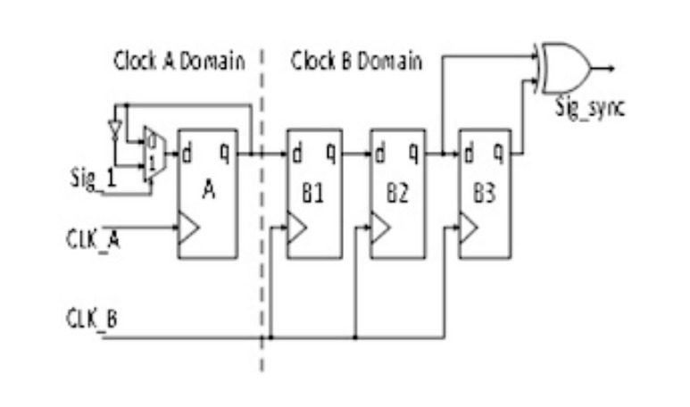

# Interview Questions List

- [Basic Digital Design](https://github.com/gs1293/pdfs/blob/main/interview/basic_digital_qa.pdf)
- [Static Timing Analysis](https://github.com/gs1293/pdfs/blob/main/books/sta_interview_questions.pdf)

##

**Question:** Input is 7-bit binary number. Output the amount of “1”s present. For ex. for the inputs 1100110 and 1001110 the result should be the same and equal to 100 (4 in binary). Can use only Full Adders. Describe the circuit with minimum amount of parts.

**Answer:** 4 full-adder units are necessary to count the amount of “1”s in a 7-bit vector.

The most important thing to notice is that a full-adder “counts” the amount of “1”s of it’s inputs. If you are not convinced , then a brief look in the component’s truth table will prove this to you. The output is a binary represented 2-bit number.

The next picture shows how to connect the four full-adders in the desired way. The first stage generates two 2-bit numbers, each represents the amount of “1”s among its respected three input bits. The second stage adds those two binary numbers together and uses the carry_in of one full-adder for the 7th bit.

<p align="middle">
  
  
</p>

https://www.eeeguide.com/half-adder-and-full-adder-circuit/

##

**Question:** Whats ripple carry adder ?

**Answer:**

##

**Question:** Make Full adder truth table

**Answer:**

##

**Question:** Write verilog code for D flop and D latch.

**Answer:**

```verilog

// D Latch with active-low reset

module d_latch
(
    input  wire d   , // 1-bit input pin for data
    input  wire en  , // 1-bit input pin for enabling the latch
    input  wire rstn, // 1-bit input pin for active-low reset
    output reg  q     // 1-bit output pin for data output
);

// This always bock is "always" triggered whenever en/rstn/d changes
// If reset is asserted then output will be zero
// Else as long as enable is high, output q follows input d

always @(en or rstn or d)
begin
    if(!rstn)   begin q <= 0; end
    else if(en) begin q <= d; end
end

```

```verilog

// D Flip-Flop with synchronous active-low reset

module dff
(
    input  wire d   ,
    input  wire rstn,
    input  wire clk ,
    output reg  q
);

always @(posedge clk)
begin
    if(!rstn) begin q <= 0; end
    else      begin q <= d; end
end

```

```verilog

// D Flip-Flop with asynchronous active-low reset

module dff
(
    input  wire d   ,
    input  wire rstn,
    input  wire clk ,
    output reg  q
);

always @(posedge clk or negedge rstn)
begin
    if(!rstn) begin q <= 0; end
    else      begin q <= d; end
end

```

##

**Question:** Setup checks and hold checks for flop-to-flop paths (All 4 combinations)

**Answer:** https://vlsiuniverse.blogspot.com/2013/07/setup-and-hold-checks-static-timing.html

##

**Question:** How would you transfer a pulse of one clock period width from clock domain A to clock domain B

**Answer:**

##

**Question:** Explain all techniques of CDC

**Answer:**

##

**Question:** How would you detect 10110 sequence

**Answer:**

##

**Question:** Write FSM of Lift

**Answer:** https://www.cs.princeton.edu/courses/archive/spr06/cos116/FSM_Tutorial.pdf

##

**Question:** Design a n mod counter and make divide by 5 frequency divider using this

**Answer:**

##

**Question:** What kind of errors or warnings do you get in lint, Do we solve all of them ?

**Answer:**

##

**Question:** If we put reset in flop, does it increase gate count ?

**Answer:**

##

**Question:** Tell the difference between synchronous and Asynchronous reset and pro and cons

**Answer:**

##

**Question:** Why do you reset all flops on frame start ?

**Answer:**

##

**Question:** What are non resettable flops and where are they used ?

**Answer:**

##

**Question:** What does it mean by 14nm in synthesis ?

**Answer:**

##

**Question:** In a system, sender is sending data at 60bytes/100clocks and at receiver end,  it is receiving at 6bytes/10clocks so find the min depth of fifo

**Answer:** [Check Case-9](https://github.com/gs1293/pdfs/blob/main/design/async_fifo_3.pdf)

##

**Question:** To delay 10bit value to 10 clocks, how many flops are needed

**Answer:**

##

**Question:** Discuss the difference between Big-Endian and Little-Endian.

**Answer:** In computing, endianness is the order or sequence of bytes of a word of digital data in computer memory. Endianness is primarily expressed as big-endian (BE) or little-endian (LE). A big-endian system stores the most significant byte of a word at the smallest memory address and the least significant byte at the largest. A little-endian system, in contrast, stores the least-significant byte at the smallest address.

| Big-Endian | Little-Endian |
| :---:      | :---:         |
|  |  |

##

* D-Flip Flop Master Slave:
<p align="middle">
  
</p>

##

Toggle Synchronizer CDC:
<p align="middle">
  
</p>

##

**Question:** How to implement a glitch free clock mux?

**Answer:** 
- https://vlsitutorials.com/glitch-free-clock-mux/
- https://www.eetimes.com/techniques-to-make-clock-switching-glitch-free/
- https://vlsiuniverse.blogspot.com/2017/03/clock-multiplexer.html
- https://rtlery.com/components/glitch-free-clock-multiplexermux

##

**Analog Devices Interview Questions from Glassdoor:**
- CDC all problems and solutions
- Setup and Hold Time
- Circuit design questions
- CMOS/NMOS/PMOS details and differences
- ADC, DAC, Resolution, Opamp problems, FPGA, microcontroller, Network Theory problems, academic projects.
- Verilog, Python basics.
- Synchronous and asynchronous circuit.
- INL, DNL, 3db gain, Nq frequency.
- Explain the spi protocol?
- basic GATE &IES level questions on counters, combinational circuits, analog devices, ADC, DAC, Zenor diode, CMOS. 40% DIGITAL ELECTRONICS, 30% ANALOG ELECTRONICS 20% C programming, project-related questions. aptitude questions. questions on diodes and mosfet.
- timing diagrams
- Digital design questions, signal processing
- Signals and Systems basics and DSP:given a system function and asked for its stability, fourier transform of a signal(given the transform and asked to find transform based on properties),asked response of a system given the input and impulse response using DFT and IDFT, a question on whether the given signal is wide sense stationary, multirate signal processing , to find the correct magnitude response of given pole zero plot -to choose among four options.
C:output of given program on pointers, linked list, function to find output of N tap FIR filter, program to reverse a string without using any temporary variable
- Fundamentals of digital design in Morris Mano can help to cross the interview process.
- Asynchronous FIFO depth calculation, System verilog testbench overview
- Basics of digital design, RC circuits and DSP sampling
- Some problems related to writing codes and state machine based questions and some quiz.
- Digital design questions. 1. Given a 3 input AND gate, design a N input AND gate. 2. Calculate FIFO depth given some parameters 3. Priority Encoder etc
