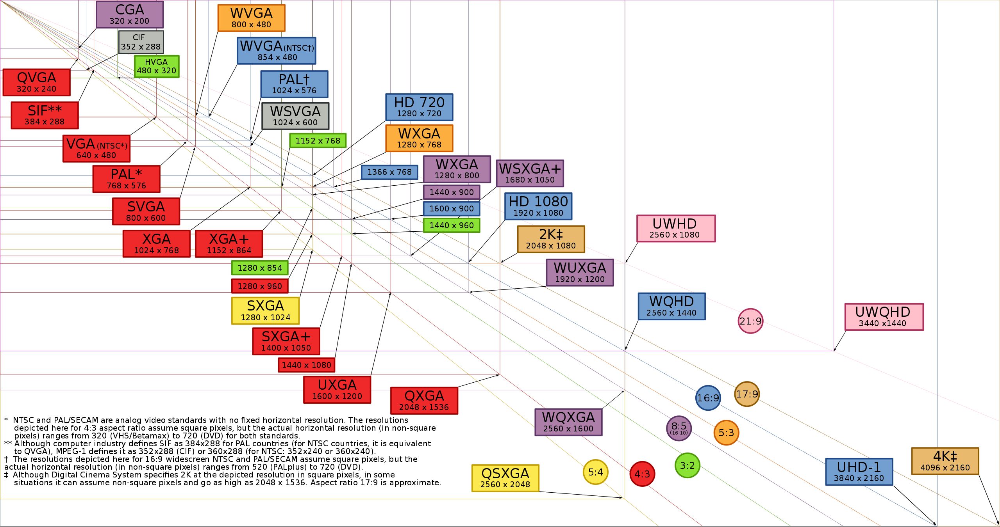
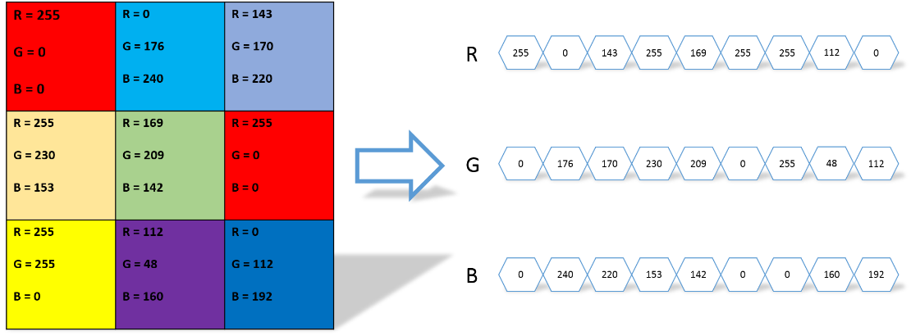
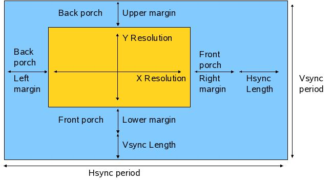
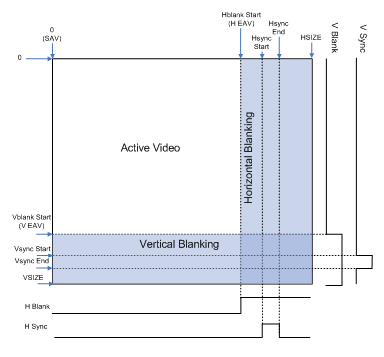
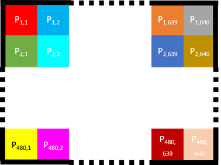
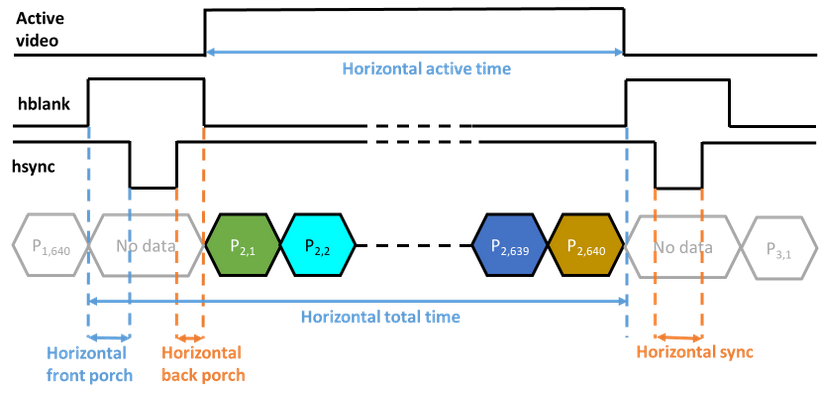
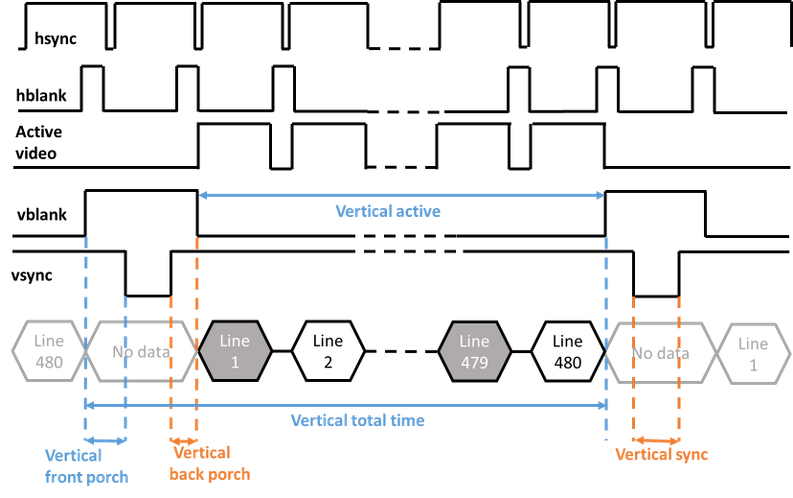
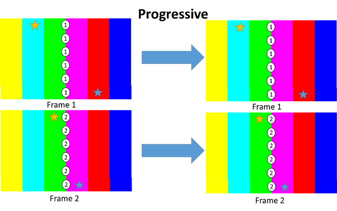
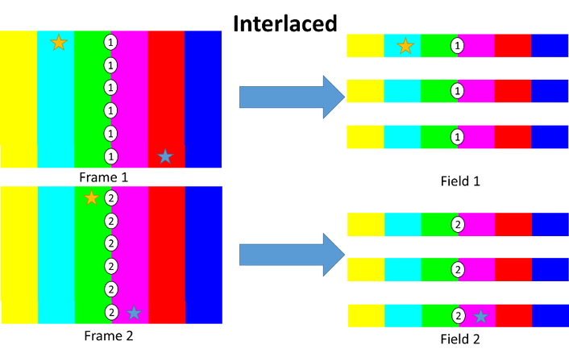

# Video Display Resolution:

[Xilinx Video Series](https://forums.xilinx.com/t5/Video-and-Audio/Xilinx-Video-Series/td-p/849583)

[How a TV Works in Slow Motion](https://www.youtube.com/watch?v=3BJU2drrtCM)

  

---

# Frame Timings Details:

A video is a series of images changing at a particular frequency (typically 50 or 60 times per second). When transmitted from a source to a monitor, a video is sent one image at the time. Each image is sent line by line starting with the top line and each line is sent pixel by pixel starting with the left pixel. For example, the figure below shows how a 3x3 pixel image could be sent to a monitor using 3 data lanes (Red Green Blue).

  

---

  

---
Along with the pixel values, timing information (carried by the timing signals) is sent to describe the video frame timing. A video frame (one single image of a video) comprises active video and blanking periods. The timing signals are horizontal and vertical blanking which represent the blanking period (commonly called hblank and vblank) and the horizontal and vertical synchronisation (commonly called hsync and vsync) which happen during the blanking period and are used to indicate when a new line (hsync) or a new frame (vsync) is starting. The time between the start of a blanking period and the start of a synchronization signal is called front porch while the time between the end of a synchronisation signal and the end of a blanking signal is called the back porch. Video systems may utilize different combinations of blanking, synchronization or active signals with various polarities. For example, a VGA interface is only using hsync and vsync. The figure below shows an example of a video frame along with the synchronization signals.

  

---
An image with 480 lines and 640 pixels per line. Each pixel will be name by its line and its column P(line,column). For example, the first pixel of the first line will be P(1,1) and the last pixel of the first line P(1,640).

  

---

Each active video line is enclosed by horizontal blanking periods during which horizontal sync signals will happen. The time between the beginning of the blanking period and the start of the sync is call front porch and the time between the end of the sync signals and the end of the blanking period is call back porch. The horizontal active time is the time between two horizontal blanking periods (excluding the time of the blanking period). For example, this is how the second line would be transmitted:

  

---

Each frame is enclosed in vertical blanking periods during which vertical sync signals will happen. The vertical active time is the time between two vertical blanking periods.

  

---

Progressive video (or non-interlaced) is what you would expect by default for video. For each frame, you are sending all of the pixels values for every line.

  

---

If you want to save some bandwidth, you can use interlaced video. In interlaced video, you only transfer half of the lines, for example the odd-numbered lines of a frame followed by the even-numbered lines of the next frame. Note that in interlaced video, each “frame” (with only half of the lines) is called a field. Sending half of the lines of each frame to create interlaced fields is called the Scan Line Decimation technique. However, this technique can create flickering if there is a sharp vertical transition in color or intensity. A better approach, called Vertical Filtering, is to use multiple progressive frames to create an interlaced field. For example, to create the fist line of a field we can use the mean value of the first line of the 2 consecutives frames.

  

